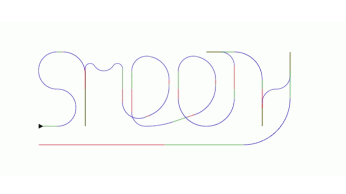

# Velocity based path Smoothing algorithm

I developed this smoothing algorithm for my small hobby game project. If you define an agent with constant acceleration and a maximum turning speed, then given a set of points intended for a path, this algorithm can create smooth transitions between the different path segments. It assumes the agent can transfer all of its momentum towards the new angle after the turn, so it's not very physically accurate, but it looks believable.

## The algorithm

Everything is explained in quite a detail in [This Jupyter file](./docs/maneuvers_design.ipynb)
I used SageMath kernel to develop an run it.

### Disclaimer

I use calculus to get the necessary equations. I'm not very good at calculus and very far from being a mathematician. So if you see anything weird or wrong, don't hesitate to open an issue. 

## Demo

I made a small javascript demo to prototype this algorithm. You can find it [here](./demo).
